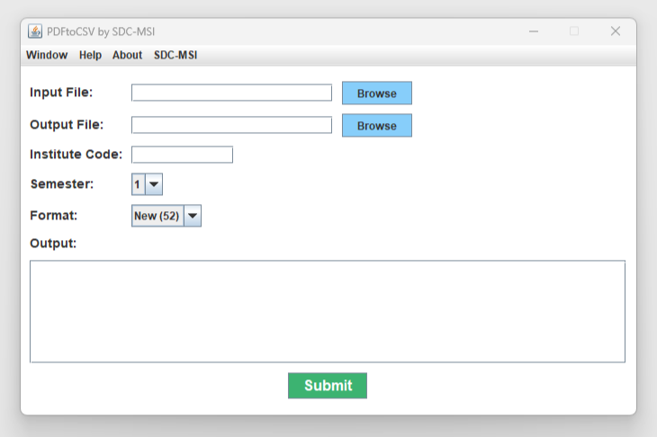

# IPU Result Extractor
It is a specialized application designed to extract class-specific results from IPU result PDFs and convert them into CSV files.

## Input Fields

1. **Input File**: Provide the file path of the input PDF. If the filename or folder includes spaces, enclose it in quotes.
2. **Output File**: Specify the file path for the resulting CSV output. If there are spaces in the filename or folder name, be sure to enclose it in quotes.
3. **Institution Code**: Provide your college's unique institution code.
4. **Semester**: Choose the relevant semester from the options.
5. **PDF Format**: Select the appropriate PDF format from the choices: "New (52)," "New (46)," or "Old."

## Format

The IPU result PDF format has undergone changes, resulting in the following options:

1.  **Old**: Refers to the previous format.
2.  **New (46)**: Implemented when IPU updated the PDF format.
3.  **New (52)** : Similar to "New (46)," but notable for the adjustment in the width of each marks column, now at 52 instead of the previous 46.

## Original authors:
raman.batra1709@gmail.com\
Neeraj
