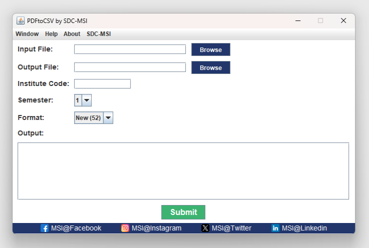

# IPU Result Extractor
It is a specialized application designed to extract class-specific results from IPU result PDFs and convert them into CSV files.




## Input Fields

1. **Input File**: Provide the file path of the input PDF. If the filename or folder includes spaces, enclose it in quotes.
2. **Output File**: Specify the file path for the resulting CSV output. If there are spaces in the filename or folder name, be sure to enclose it in quotes.
3. **Institution Code**: Provide your college's unique institution code.
4. **Semester**: Choose the relevant semester from the options.
5. **PDF Format**: Select the appropriate PDF format from the choices: "New (52)," "New (46)," or "Old."


## Format

The IPU result PDF format has undergone changes, resulting in the following options:

1.  **Old**: Refers to the previous format.
2.  **New (46)**: Implemented when IPU updated the PDF format.
3.  **New (52)** : Similar to "New (46)," but notable for the adjustment in the width of each marks column, now at 52 instead of the previous 46.

## How to install

To use PDFtoCSV on your computer, follow these steps:

1. Download and install Java. The newest release is usually best. Download link: https://jdk.java.net/21/

2. Follow the installation instructions and complete the Java installation.

3. Now, go the the "Releases" section of this repository, which can be found to the right of the page.

4. Click on the .jar file to download it to your computer.

5. Double click the jar file, if everything is properly set up, PDFtoCSV should launch.

6. Finished!

## How to build

If you want to build PDFtoCSV yourself or would like to develop on it, please make sure that Maven and git is installed on your system.

Then, you can build this branch (maven-build) by executing the following steps:

```bash
# Clone repository
git clone https://github.com/HotDogEnemy/pdftocsv.git

# cd into the cloned directory
cd pdftocsv

# Build the software
mvn clean package

# Run the .jar file generated by maven
java -jar target/pdftocsv-1.0.0-jar-with-dependencies.jar
```

## Original authors:
raman.batra1709@gmail.com\
Neeraj
